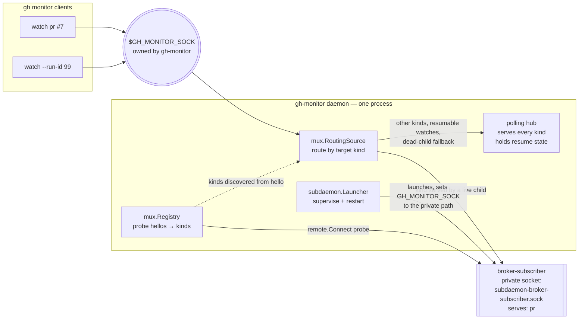

# AGENTS.md

Operating notes for coding agents working in this repository. Each rule below
exists because getting it wrong has already cost a broken release or a failed
command — the linked documentation is authoritative, this file is the index.

## Invoking the extension

There is **no `monitor` subcommand.** Monitoring is the default command, so the
PR number is the only positional argument:

```sh
gh monitor -R owner/repo 42            # correct
gh monitor monitor -R owner/repo 42    # fails: "accepts at most 1 arg(s), received 2"
```

Run `gh monitor --help` for the real subcommand list (`comments`, `draft`,
`prefs`, `react`, `review`, `threads`). Trust `--help` over any prose, including
this file.

## Daemon socket ownership

**gh-monitor owns `$GH_MONITOR_SOCK`. Sub-daemons never bind it.** This was
not always true — v1.19.0–v1.22.0 conceded the socket to whichever sub-daemon
bound it first, which left every target kind that sub-daemon did not serve
(workflow runs, repos, issues) with no serving path and cost a long debugging
session. Since the routing rework ([#88](https://github.com/elecnix/gh-monitor/issues/88),
[#89](https://github.com/elecnix/gh-monitor/pull/89)) the topology is:



Practical consequences when debugging or extending the daemon:

- A `pr` watch is served by broker-subscriber **without touching the GitHub
  API** — the hub never creates a poller for it. Polling for `pr` only happens
  as a fallback (broker child down, or a resumable watch, whose state lives in
  the hub).
- Sub-daemon children bind private sockets next to the daemon socket
  (`subdaemon-<name>.sock`); the launcher redirects them via
  `GH_MONITOR_SOCK`. If you see one bound to the public path, something is
  running an old binary.
- "watching requires the shared-poller daemon" means no daemon owns the
  public socket — not that a sub-daemon is missing.

## Releasing

Read [`.github/workflows/release.yml`](.github/workflows/release.yml) before
cutting a release. The rules that matter:

1. **A tag-push run uses the workflow file _at the tagged commit_, not the one
   on `main`.** Tagging before a workflow fix has merged runs the old, broken
   workflow. Merge the fix first, then tag. See
   [GitHub Actions: events that trigger workflows](https://docs.github.com/en/actions/writing-workflows/choosing-when-your-workflow-runs/events-that-trigger-workflows#push).
2. **Tags are lightweight and match `v*`.** Pushing the tag is what triggers the
   release — there is no manual release step:
   ```sh
   git tag v1.13.0 <sha> && git push origin v1.13.0
   ```
3. **`workflow_dispatch` does not work for releases.** The job derives the tag
   from `github.ref_name`, which is the branch name on a manual dispatch.
4. **Moving a tag needs a force push, which agents are typically denied.** If
   you tag the wrong commit, expect to cut the next patch version rather than
   re-point the tag. Tag only once the commit you want is on `main`.
5. **Verify before announcing.** A green run is not the same as a published
   release:
   ```sh
   gh release view v1.13.0 --json tagName,isDraft,assets
   ```
   Expect five assets: `darwin-amd64`, `darwin-arm64`, `linux-amd64`,
   `linux-arm64`, `windows-amd64.exe`, built by
   [`script/build.sh`](script/build.sh) via
   [`cli/gh-extension-precompile`](https://github.com/cli/gh-extension-precompile).
6. **Confirm the upgrade against the binary, not the manifest.**
   `gh extension list` prints the install manifest's `tag:`, which is not
   derived from the executable. Ask the binary:
   ```sh
   gh monitor --version
   # gh monitor v1.17.0 (55d9154, 2026-08-11T15:24:54Z, go1.22.12)
   ```
   The tag comes from an `-ldflags -X` stamp that
   [`script/build.sh`](script/build.sh) applies;
   `cli/gh-extension-precompile` passes the release tag to the override script
   as `$1`, so the release workflow needs no version plumbing of its own. The
   revision and build time come from the Go toolchain's own VCS stamp.

### Self-hosted runner constraints

CI and releases run on `arc-runners`, **not** `ubuntu-latest`. The image is
minimal: no `gh`, no `wget`. `apt-get` and `curl` are available.

Any step installing tooling must `set -euo pipefail`. Without it a failed
download still writes an empty file and the job fails later with an unrelated
message — a missing `wget` surfaced as
`NO_PUBKEY … repository is not signed`, which sent two releases' worth of
debugging in the wrong direction. Follow the official
[gh install instructions for Debian/Ubuntu](https://github.com/cli/cli/blob/trunk/docs/install_linux.md#debian-ubuntu-linux-apt).

## Quality gates

CI is [`.github/workflows/ci.yml`](.github/workflows/ci.yml). Run all three
locally before opening a PR:

```sh
npx --yes prettier --check "*.md" "docs/*.md" "skills/**/*.md"
go test ./...
golangci-lint run --timeout=5m
```

- **Prettier covers root-level Markdown**, so `README.md` and this file are
  checked. Formatting drift fails the build. Configuration is
  [Prettier's defaults](https://prettier.io/docs/options) — there is no
  `.prettierrc`.
- **`golangci-lint` has pre-existing findings** in `internal/prefs` and
  `internal/monitor/detail.go`. They are on `main` and CI tolerates them. Fix
  what you touch; do not go chasing the rest.
- **`gofmt` is not enforced by CI** and a few files are unformatted on `main`.
  Format your own changes; leave the others.

## Building inside a worktree

`go build` and `go test` fail in a linked worktree with:

```
error obtaining VCS status: exit status 128
```

Pass `-buildvcs=false`. This affects local runs only — CI checks out normally
and is unaffected. See [`go help build`](https://pkg.go.dev/cmd/go#hdr-Compile_packages_and_dependencies).

```sh
go test -buildvcs=false ./...
```

`-buildvcs=false` also strips the VCS stamp, so a worktree-built binary reports
`unknown revision` from `gh monitor --version`. That is expected and is why the
release version comes from an explicit `-ldflags -X` stamp rather than from VCS
metadata alone. To exercise the revision path locally, build from a normal
clone rather than a linked worktree.

## Pull requests

- Open as **draft**; mark ready once CI is green.
- Titles follow [Conventional Commits](https://www.conventionalcommits.org/en/v1.0.0/)
  (`fix(monitor):`, `docs(skill):`, `ci:`).
- PRs are **squash-merged**, so a branch's individual commits never appear on
  `main`. Use `git cherry main <branch>` rather than `git log main..<branch>`
  when deciding whether a branch is safe to delete — ancestry checks report
  merged work as unmerged.
- Reply to each review thread separately and resolve it; never bundle replies.
- Fix CI failures silently — push the fix, do not comment about CI status.

## Testing conventions

Follow red, green, refactor, and make fixtures mirror states the API actually
returns. A `CheckSuite` with a blank `status` and blank `conclusion` does not
exist in GitHub's API; a fixture like that passes "is CI clean?" for the same
accidental reason a _missing_ suite does, so the test proves nothing. Use real
terminal values (`COMPLETED` / `SUCCESS`) and cover the empty case explicitly.

`CheckStatusState` has six values — `COMPLETED`, `IN_PROGRESS`, `PENDING`,
`QUEUED`, `REQUESTED`, `WAITING`. Anything that is not `COMPLETED` is still in
flight. See the
[GraphQL API reference](https://docs.github.com/en/graphql/reference/enums#checkstatusstate).
